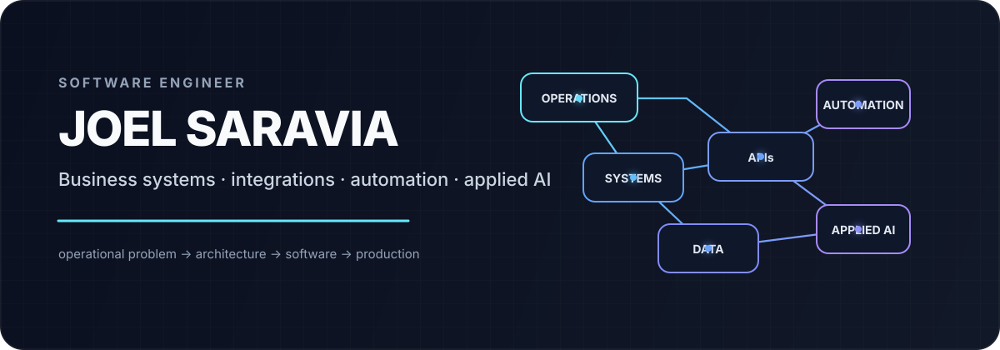

<p align="center">
  
</p>

<p align="center">
  <a href="https://www.linkedin.com/in/josaraviam">LinkedIn</a>
</p>

I build software at the boundary between **business operations and engineering**.

My path started in customer operations and analytics, moved through digital transformation and platform engineering, and is now expanding into applied AI. That background matters: I tend to start with the workflow, constraints, users, and failure modes before deciding what the software should look like.

> **Customer Operations → Analytics / Process Improvement → Platform Engineering → AI-enabled Technical Solutions**

## What I build

| Business systems | Integrations | Automation | Applied AI |
| --- | --- | --- | --- |
| Turn operational processes into reliable software workflows. | Connect platforms, services, identity, and data through clear API contracts. | Remove manual work while preserving business rules, traceability, and control. | Combine models with tools, APIs, structured data, guardrails, and deterministic software. |

My working surface includes backend services, REST APIs, SQL and relational data, OAuth and identity, enterprise platforms, React/TypeScript interfaces, CI/CD, and production troubleshooting.

## Selected work

### `01` AI Customer Ops
**Applied AI / agentic systems**

An applied AI engineering project for customer-service workflows. It is being built as a software system rather than an isolated chatbot: Python services, typed tool calling, structured outputs, API integrations, an agent loop, and automated tests.

Current work is extending the system with retrieval and grounding, evals, tracing and observability, stronger security boundaries, and deployment.

<sub>Public case study and source are being prepared for release.</sub>

---

### `02` Salesforce Service Lab
**Enterprise engineering / integration architecture**

A clean-room lab for customer-service architecture covering Service Cloud patterns, Apex and Flow, REST integrations, OAuth, least-privilege access, CI/CD, release engineering, and AI-enabled service workflows.

The goal is to make enterprise platform engineering inspectable and reproducible instead of presenting it only as platform configuration.

<sub>Public case study and source are being prepared for release.</sub>

---

### `03` Product Engineering
**Full-stack systems / platform services**

Independent and project-based work spanning backend APIs, relational data models, authentication and authorization, third-party integrations, React/TypeScript frontends, deployment infrastructure, and operating software beyond the initial implementation.

<sub>Additional public case studies are in progress.</sub>

## How I work

```text
operational problem
        ↓
    discovery
        ↓
  architecture
        ↓
 implementation
        ↓
  integration
        ↓
 testing + security
        ↓
    deployment
        ↓
    operation
        ↺
```

I care about the full path from problem to production: system boundaries, integration contracts, authentication and authorization, failure handling, observability, least privilege, maintainability, CI/CD, and what happens after software ships.

## Current focus

I'm deepening my work in **applied AI engineering**, particularly agentic systems where a model is one component inside a larger software architecture.

The current focus is on tool use, retrieval and grounding, evaluation, observability, security boundaries, and AI workflows that can interact safely with real APIs and business systems.

The underlying problem has stayed consistent throughout my career:

> **How do we make complex operations work better through software?**
