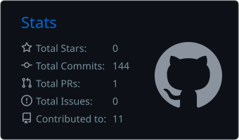
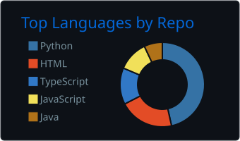

# Hey! I'm Joel 👋

### Software Engineer · Salesforce · Applied AI · Probably automating something

🧑‍💻 I like turning complex and messy real-world problems into software.  
🧩 I really enjoy giving structure to things that absolutely do not have any.  
🔌 I also somehow enjoy debugging APIs and integrations that "should work".  
🤖 Playing with AI agents, RAG, tool use, evals, and automation.  
🌎 Based in Mexico.  
🎮 When I'm not coding, there's a decent chance I'm playing something.

**🧪 currently:** probably debugging an API or integration that "should work".

## 🚧 Currently building

🤖 **AI Customer Ops** — agentic systems + real APIs. Tools, evals, guardrails... MCP? maybe later.

☁️ **Salesforce Service Lab** — Salesforce engineering. Yup, read that again. Not just "flows and colors": Apex, APIs, OAuth, security, CI/CD, Agentforce... the fun stuff.

📊 **CX Analytics Lab** — AI and Service need data, so... pipelines, metrics, and enough operational context to make the mess measurable.

🛠️ **And probably something work-related** — Salesforce, Meta/WhatsApp APIs, n8n, GCP, or whatever two systems someone decided should talk to each other.

## 📊 Stats

  
  

## 🌐 Find me around

  
  
  

---

> **yes:** Salesforce and n8n can involve actual software engineering 😌

🐇 Rabbit animation by <a href="https://opengameart.org/content/drunk-rabbit">hansolo</a> · CC BY-SA 3.0
